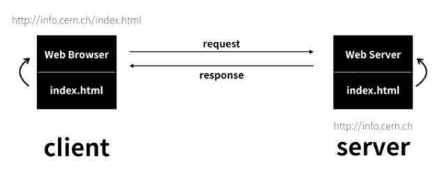
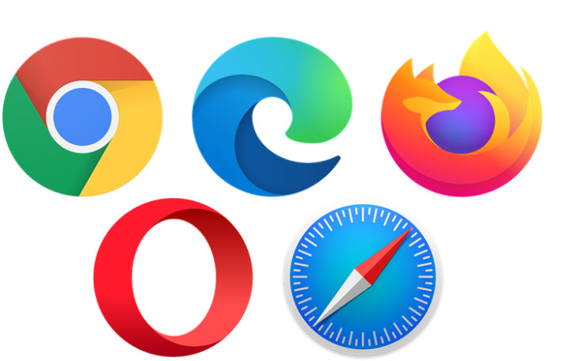
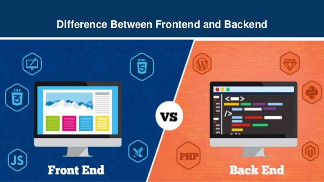

# 웹과 인터넷 개념

# 인터넷(Internet)

전 세계에 걸쳐 원거리 접속이나 파일 전송, 전자 메일 등의 데이터 통신 서비스를 받을 수 있는, 컴퓨터 네트워크의 시스템

# WWW(World Wide Web)

- 하이퍼텍스트와 멀티미디어를 통해 서비스를 이용할 수 있도록 구축
- 사용자끼리 정보를 공유할 수 있는 공간
- 인터넷 상의 다양한 정보를 효과적으로 검색할 수 있는 시스템

# HTTP 프로토콜(Protocol)

- 요청(Request)과 응답(Response)의 형태로 이루어진 웹(Web) 통신 규약

# 웹 서버와 클라이언트(Web Server & Client)

- 웹 서버 : 클라이언트의 요청을 처리하여 응답함
- 클라이언트 : 웹 서버에 원하는 정보를 요청함

1. 클라이언트가 웹 서버에 index.html 파일을 요청(request)
2. 웹 서버는 index.html을 응답(response)하여 클라이언트에게 전송
3. 클라이언트의 웹브라우저(Chrome, Microsoft Edge 등)는 index.html 파일을 해석하여 클라이언트에게 웹 페이지를 보여줌

# 웹 페이지(Web Page)

- 클라이언트가 웹 서버에 정보를 요청한 후, 서버에서 보낸 정보를 담고 있는 문서
- 기본적으로 HTML로 작성됨

# 웹 브라우저(Web Browser)

- HTML로 작성된 웹 페이지를 해석하여 사용자에게 보여줌
- 일종의 컴파일러로 생각될 수 있으며, W3C에서 이에 대한 표준을 제공함
- Chrome, Internet Explorer, Microsoft Edge, Firefox, Safari, Whale 등이 있음

# W3C(World Wide Web Consortium)

- [www.w3.org](https://www.w3.org/)
- 여러 참여기관들이 협력하여 웹 표준을 개발하는 국제 컨소시엄
- 웹의 프로토콜과 가이드라인 개발

# 웹 프로그래밍(Web Programming)

- **프론트 엔드(Front-End) 개발**
    - 사용자와 직접 접촉하여 상호작용하는 실제 보여지는 웹 페이지를 개발
    - HTML로 웹페이지의 뼈대를 구성
    - CSS로 웹페이지의 스타일을 구성
    - JavaScript로 사용자와 상호작용을 가능하게하여 동적인 웹 페이지 구성
- **백 엔드(Back-End) 개발**
    - 사용자에게 보이지 않는 실제 구성 시스템과 서버 사이드의 개발 (서버, 데이터베이스 등)
    - 주로 JAVA, Python, Ruby, PHP, SQL 등의 언어가 사용됨

# 웹 프로그래밍 언어

웹 페이지를 구성하기 위해 주로 HTML, CSS, JavaScript 언어를 사용

## HTML(Hyper Text Markup Language)

- 웹 페이지를 작성하는 언어
- Hyper Text : 링크가 달려있는 Text
- Markup Language : 태그 기호(`<`, `>`) 등을 사용하여 문서나 데이터를 기술하는 언어

### HTML5 주요 기능

- 멀티미디어: 플러그인 없이 음악과 동영상 재생 가능
- 그래픽: 2차원 그래픽, 3차원 그래픽 구현
- 통신: 서버와 실시간으로 쌍방향 통신
- 장치: 장치와의 연동을 통해 접근 및 기능 사용
- 오프라인: 인터넷 연결 없이도 응용 프로그램 동작 가능
- 시맨틱: 정보를 분석, 자료를 검색 및 처리하여 제공하는 지능형 웹

## CSS(Cascading Style Sheet)

- 스타일 시트의 표준안이며 현재 CSS3가 사용됨
- HTML로 웹 페이지의 뼈대를 구성하고, CSS로 스타일(디자인)을 구성함
- 문서 작성과 디자인을 분리하여 효율적으로 웹페이지를 개발

### 자바스크립트(JavaScript)

- 사용자와의 상호작용을 통해 동적인 웹페이지를 구성하고자 고안된 언어
- HTML이 웹페이지의 뼈대를 구성하고 CSS가 디자인을 담당하며, JavaScript는 사용자와 상호작용 및 웹페이지 제어를 담당
- 객체 기반의 인터프리트 언어
- 구조적 프로그래밍, 함수형 프로그래밍 지원
