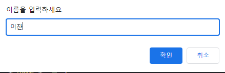
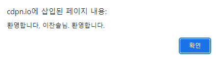
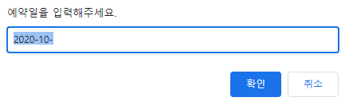
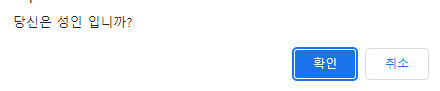

# 02. 대화상자 (alert, prompt, confirm)

### 대화 상자

1. `**alert**` : 알려줌
2. `**prompt**` : 입력 받음
3. `**confirm**` : 확인 받음

### `alert()` :

- 함수 실행 시, 메시지 표시
- **사용자가 확인을 누르기 전 까지 계속 표시**

### `prompt()` :

- **입력 받을 수 있는 창을 표시**
- **입력받은 값은 문자형**
- ‘취소’를 누르면 `null`할당
- `default`값 사용 가능

```jsx
const name = prompt("이름을 입력하세요.");
alert("환영합니다. " + name + "님");
```





```jsx
const name = prompt("이름을 입력하세요.");
alert(`환영합니다, ${name}님. 환영합니다.`)
console.log(name)
```

```
"이찬솔"
```



```jsx
const name = prompt("예약일을 입력해주세요.", "2020-10-");
// "2020-10-" = default값
console.log(name)
```



### `confirm()` :

- 확인과 취소 버튼 함께
- 확인 클릭 시 true / 취소 클릭 시 false

```jsx
const isAdult = confirm("당신은 성인 입니까?");
console.log(isAdult)
```



```
true
```

## 기본 대화상자의 단점

1. 스크립트 일시 정지
2. 스타일링 불가능 (위치와 모양 디자인 불가) 
    
    ⇒ 실무에서는 HTML과 CSS로 제작
