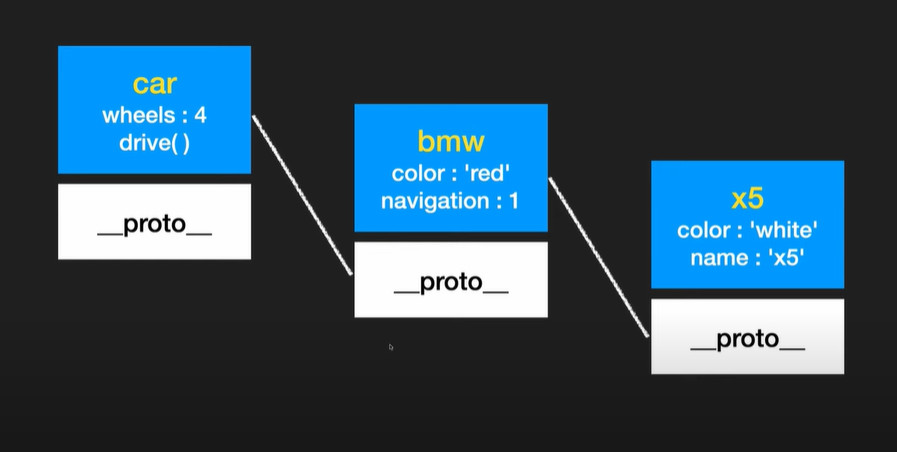

# 21. 상속, prototype

### `hasOwnProperty()` : 객체에 속성이 있는지 여부를 true/false여부로 반환

- `hasOwnProperty()`는 객체의 ‘`__proto__`’ (프로토타입)에 위치

```jsx
const user = {
  name: 'Mike'
}

console.log(user.hasOwnProperty('name'));
console.log(user.hasOwnProperty('age'));
```

```
true
 
false
```

---

## 상속

```jsx
const car = {
  wheels: 4,
  drive() {
    console.log("drive..");
  },
};

const bmw = {
  color: 'red',
  navigation: 1,
};

bmw.__proto__ = car;

console.log(bmw.color);
console.log(bmw.wheels);
```

```
"red"

4
```

### **상속의 재상속 (Prototype Chain)**



- **car을 상속한 bmw를 상속한 x5**

```jsx
const car = {
  wheels: 4,
  drive() {
    console.log("drive..");
  },
};

const bmw = {
  color: 'red',
  navigation: 1,
};

bmw.__proto__ = car;
console.log(bmw.color);
console.log(bmw.wheels);

const x5 = {
  color: 'white',
  name: "x5"
};

x5.__proto__ = bmw;
console.log(x5.name);
console.log(x5.color);
console.log(x5.navigation);
```

```
"red"

4
```

```
"x5"

"white"

1
```

### **`hasOwnProperty`는 상속이 아닌, 객체가 직접 가지고 있는 속성만 해당**

```jsx
const car = {
  wheels: 4,
  drive() {
    console.log("drive..");
  },
};

const bmw = {
  color: 'red',
  navigation: 1,
};
bmw.__proto__ = car;

const x5 = {
  color: 'white',
  name: "x5"
};
x5.__proto__ = bmw;
```

```jsx
for(p in x5) {
  console.log(p);
}
console.log(x5);
Object.keys(x5);
Object.values(x5);

for (p in x5) {
  if(x5.hasOwnProperty(p)) {
    console.log('o', p);
  } else {
    console.log('x', p);
  }
}
```

```
"color"
"name"
"navigation"
"wheels"
"drive"

// [object Object] 
{
  "color": "white",
  "name": "x5"
}
```

```
"o" "color"
"o" "name"
"x" "navigation"
"x" "wheels"
"x" "drive"
```

```jsx
const Bmw = function(color) {
  this.color = color;
};

Bmw.prototype.wheels = 4;
Bmw.prototype.drive = function() {
  console.log("drive..");
};
Bmw.prototype.navigation = 1;
Bmw.prototype.stop = function() {
  console.log("Stop");
};

const x5 = new Bmw("red");
const z4 = new Bmw("blue");

console.log(x5.wheels);
console.log(x5.drive());
console.log(x5.navigation);
console.log(x5.stop());
```

```
4

"drive.."

1

"Stop"
```

---

### 생성자 함수가 새로운 객체를 만들어 낼 때, 
해당 객체는 생성자의 `instance`

## `instanceof` : 객체와 생성자 비교

- 해당 객체가 생성자로 부터 만들어 졌는지 true / false로 반환
- 생성자로 만든 instance 객체에는 constructor 속성이 존재
    - **constructor 속성을 통해 생성자 함수를 알 기 위해서는, 아래와 같이 하나씩 속성을 정의해주거나**
        
        ```jsx
        const Bmw = function(color) {
          this.color = color;
        };
        
        Bmw.prototype.wheels = 4;
        Bmw.prototype.drive = function() {
          console.log("drive..");
        };
        Bmw.prototype.navigation = 1;
        Bmw.prototype.stop = function() {
          console.log("Stop");
        };
        
        const z4 = new Bmw("blue");
        
        console.log(z4);
        console.log(z4 instanceof Bmw); // z4의 instance는 Bmw라는 생성자 함수의 instance인가?
        console.log(z4.constructor === Bmw); // z4가 Bmw라는 생성자 함수로 부터 만들어졌는가?
        ```
        
        ```
        // [object Object] 
        {
          "color": "blue"
        }
        
        true
        
        true
        ```
        
    - **수도로 명시**
        
        ```jsx
        const Bmw = function(color) {
          this.color = color;
        };
        
        Bmw.prototype = {
          constructor: Bmw,
          wheels:4,
          drive() {
            console.log("drive..");
          },
          navigation: 1,
          stop() {
            console.log("Stop");
          },
        };
        
        const x5 = new Bmw("red");
        const z4 = new Bmw("blue");
        
        console.log(z4);
        console.log(z4 instanceof Bmw);
        console.log(z4.constructor === Bmw);
        ```
        
        ```
        // [object Object] 
        {
          "color": "blue"
        }
        
        true
        
        true
        ```
        
    

---

### 클로저를 사용하여, 생성자 함수의 초기값을 고정

```jsx
const Bmw = function (color) {
  const c = color;
  this.getColor = function () {
    console.log(c);
  };
};

const x5 = new Bmw("red");
console.log(x5.getColor());
```

```
"red"
```