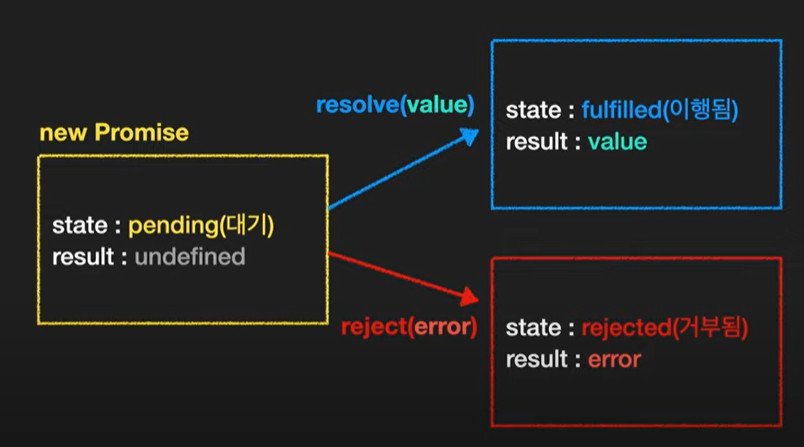

# 23. 프로미스 (Promise), async, await

## 프로미스

- **특정한 일이 완료 되는 경우 실행되는 함수 (= callback 함수)**
- **`resolve`** : 성공한 경우
- **`reject`** : 실패한 경우

```jsx
const pr = new Promise( (resolve, reject) => {
	// code
});
```

### `new Promise` 를 통해 생성된 객체는 `state`와 `reseult` 를 속성으로 가짐



### `then`

```jsx
const pr = new Promise( (resolve, reject) => {
  setTimeout(() => {
    resolve('OK')
  }, 3000)
});

pr.then(
  function(result){}, // 이행 되었을 때 실행
  function(err){} // 거부 되었을 때 실행
);
```

### `catch`

```jsx
const pr = new Promise( (resolve, reject) => {
  setTimeout(() => {
    resolve('OK')
  }, 3000)
});

pr.then(
  function(result){}
).catch(
  function(err){}
)
```

### `finally`

- 1초뒤에 성공되는 **`Promise`**

```jsx
const pr = new Promise( (resolve, reject) => {
  setTimeout(() => {
    resolve('OK')
  }, 1000)
});

pr.then((result) => {
  console.log(result);
})
  .catch((err) => {
  console.log(err);
})
  .finally(() => {
  console.log("끝");
});
```

```
"OK"

"끝"
```

---

## Callback Hell

```jsx
const f1 = (callback) => {
  setTimeout(function () {
    console.log("1번 주문");
    callback();
  }, 1000);
};

const f2 = (callback) => {
  setTimeout(function () {
    console.log("2번 주문");
    callback();
  }, 3000);
};

const f3 = (callback) => {
  setTimeout(function () {
    console.log("3번 주문");
    callback();
  }, 2000);
};

console.log('시작')
f1(function() {
  f2(function () {
    f3(function () {
      console.log('끝');
    });
  });
});
```

```
"시작"

"1번 주문"

"2번 주문"

"3번 주문"

"끝"
```

### Promise chain로 Callback hell방지

```jsx
const f1 = () => {
  return new Promise((res, re) => {
    setTimeout(() => {
      res("1번 주문 완료");
    }, 1000);
  });
};

const f2 = (message) => {
  console.log(message);
  return new Promise((res, re) => {
    setTimeout(() => {
      res("2번 주문 완료");
    }, 2000);
  });
};

const f3 = (message) => {
  console.log(message);
  return new Promise((res, re) => {
    setTimeout(() => {
      res("3번 주문 완료");
    }, 3000);
  });
};

console.log('시작');

f1()
  .then((res) => f2(res))
  .then((res) => f3(res))
  .then((res) => console.log(res))
  .finally(() => {
  console.log('끝');
});
```

```
"시작"

"1번 주문 완료"

"2번 주문 완료"

"3번 주문 완료"

"끝"
```

---

## `Promise.all` : Promise의 병렬 실행
⇒ Promise chain보다 시간 단축

- **하지만 병렬 실행하는 `Promise.all`에서 하나의 `Promise`라도 실패인 경우 ⇒ Error 반환**

```jsx
const f1 = () => {
  return new Promise((res, re) => {
    setTimeout(() => {
      res("1번 주문 완료");
    }, 1000);
  });
};

const f2 = (message) => {
  console.log(message);
  return new Promise((res, re) => {
    setTimeout(() => {
      res("2번 주문 완료");
    }, 2000);
  });
};

const f3 = (message) => {
  console.log(message);
  return new Promise((res, re) => {
    setTimeout(() => {
      res("3번 주문 완료");
    }, 3000);
  });
};

Promise.all([f1(), f2(), f3()]).then((res) => {
  console.log(res);
});
```

```
// [object Array] (3)
["1번 주문 완료","2번 주문 완료","3번 주문 완료"]
```

---

## `Promise.race` : 실행하는 복수의 Promise들 중 하나라도 성공하는 순간 종료

```jsx
const f1 = () => {
  return new Promise((res, re) => {
    setTimeout(() => {
      res("1번 주문 완료");
    }, 1000);
  });
};

const f2 = (message) => {
  console.log(message);
  return new Promise((res, re) => {
    setTimeout(() => {
      res("2번 주문 완료");
    }, 2000);
  });
};

const f3 = (message) => {
  console.log(message);
  return new Promise((res, re) => {
    setTimeout(() => {
      res("3번 주문 완료");
    }, 3000);
  });
};

Promise.race([f1(), f2(), f3()]).then((res) => {
  console.log(res);
});
```

```
"1번 주문 완료"
```

---

## `async` / `await`

```jsx
const f1 = () => {
  return new Promise((res, re) => {
    setTimeout(() => {
      res("1번 주문 완료");
    }, 1000);
  });
};

const f2 = (message) => {
  console.log(message);
  return new Promise((res, re) => {
    setTimeout(() => {
      res("2번 주문 완료");
    }, 2000);
  });
};

const f3 = (message) => {
  console.log(message);
  return new Promise((res, re) => {
    setTimeout(() => {
      res("3번 주문 완료");
    }, 3000);
  });
};

console.log("시작");
async function order() {
  const result1 = await f1();
  const result2 = await f2(result1);
  const result3 = await f3(result2);
  console.log(result3);
  console.log("종료");
}

console.log(order());
```

```
"시작"

"1번 주문 완료"

"2번 주문 완료"

"3번 주문 완료"

"종료"
```

### Promise중 하나가 에러일 경우
⇒ `try` 문과 `catch`문 사용

- **에러를 처리하고 다음 Promise 실행**

```jsx
const f1 = () => {
  return new Promise((res, re) => {
    setTimeout(() => {
      res("1번 주문 완료");
    }, 1000);
  });
};

const f2 = (message) => {
  console.log(message);
  return new Promise((res, re) => {
    setTimeout(() => {
      res(new Error("err.."));
    }, 2000);
  });
};

const f3 = (message) => {
  console.log(message);
  return new Promise((res, re) => {
    setTimeout(() => {
      res("3번 주문 완료");
    }, 3000);
  });
};

console.log("시작");
async function order() {
  try{
    const result1 = await f1();
    const result2 = await f2(result1);
    const result3 = await f3(result2);
    console.log(result3);  
  } catch (e) {
    console.log(e);
  }
  console.log("종료");
}

console.log(order());
```

```
"시작"

"1번 주문 완료"

"3번 주문 완료"

"종료"
```